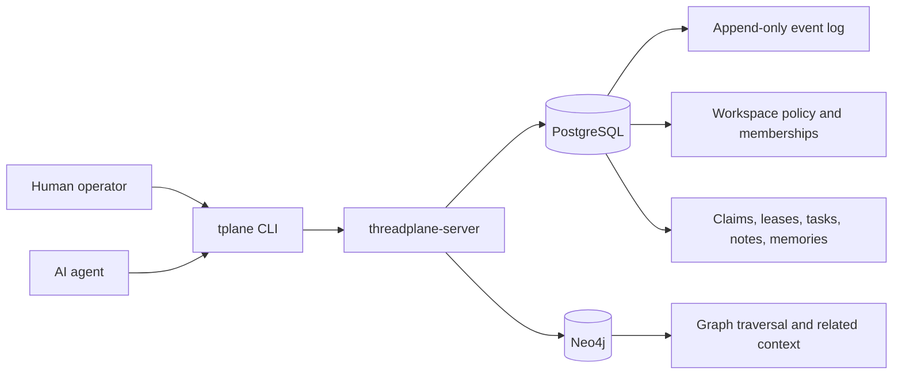

# threadplane

[](./docs/threadplane-demo.cast)

`threadplane` is a shared coordination plane for people and AI agents. It gives both of them the same durable place to leave tasks, claims, notes, memories, dependencies, and graph-linked context so work can survive handoffs, restarts, and new sessions without dissolving into chat history.

> [!TIP]
> Click the animation above to open the source asciinema cast. Regenerate it locally with `./scripts/regenerate-demo.sh`.

> [!IMPORTANT]
> `threadplane` is already useful for dogfooding and shared development, but it is still a POC. Durable workspace governance is live today. Cryptographic request signing with public keys is the next major layer.

## Table Of Contents

- [Why It Exists](#why-it-exists)
- [What You Get Today](#what-you-get-today)
- [Get Started Fast](#get-started-fast)
- [Choose Your First Workflow](#choose-your-first-workflow)
- [The Big Idea In One Picture](#the-big-idea-in-one-picture)
- [Why Xanadu Links Matter](#why-xanadu-links-matter)
- [Core Concepts](#core-concepts)
- [Workspace Governance](#workspace-governance)
- [CLI Map](#cli-map)
- [Configuration](#configuration)
- [Development Loop](#development-loop)
- [Architecture At A Glance](#architecture-at-a-glance)
- [Current Status](#current-status)
- [Read Next](#read-next)

## Why It Exists

Most tools in this space solve only part of the problem:

| Tool shape | What it gets right | What still hurts |
| --- | --- | --- |
| Memory-only tools | Agents remember facts | Work handoff and dependency tracking stay weak |
| Collaboration tools | Multiple people can coordinate | Context is often not graph-backed or durable enough for agents |
| Graph stores | Rich traversal and relationships | Day-to-day workflow feels too infrastructural |
| Event logs | Strong history and replay | Humans and agents still need a usable shared interface |

`threadplane` tries to combine the pieces into one practical control plane:

- one server accepts writes
- PostgreSQL keeps the durable source of truth
- Neo4j serves graph traversal and contextual reads
- `tplane` gives humans and agents the same workflow surface

## What You Get Today

| Capability | What it means in practice |
| --- | --- |
| First-class epics and tasks | Plan work explicitly instead of hiding it in notes |
| Task DAGs | Model dependencies and surface only ready work |
| Lease-backed claims | Let agents claim work safely without permanent lockups |
| Notes and structured memories | Capture both ad hoc context and durable prime-worthy guidance |
| Xanadu links | Keep note text and task text synchronized across linked entities |
| Graph-backed entity reads | Traverse related context from tasks, notes, epics, and memories |
| Workspace policy | Control supported priorities, roles, memberships, and public keys |
| CLI + HTTP parity | Humans and agents use the same shared model |

High-value workflows that are already working:

- prime a new agent session with durable memories
- claim the next best ready task
- attach notes and link them semantically or with Xanadu semantics
- inspect blockers, dependents, and graph relations
- tail workspace activity incrementally
- manage workspace policy and memberships

## Get Started Fast

### The fastest local path

Generate local credentials and config:

```bash
$ ./scripts/generate-env.sh
generated /home/you/path/to/threadplane/.env
generated /home/you/.config/threadplane/config.toml
```

Bring up the durable local stack:

```bash
$ docker compose up -d
[+] Running 2/2
 ok Container threadplane-postgres-1  Started
 ok Container threadplane-neo4j-1     Started
```

Start the server:

```bash
$ cargo run -p threadplane-server
threadplane_server: bootstrapping server runtime
threadplane_server: connected external dependencies
threadplane_server: server listening
```

Install the CLI:

```bash
$ cargo install --path crates/threadplane-cli --locked
  Installing tplane v0.1.0 (...)
   Installed package `tplane`
```

Sanity-check the stack:

```bash
$ tplane scope
{
  "build": {
    "service": "threadplane-server",
    "version": "0.1.0"
  },
  "projection": {
    "projection_name": "neo4j_graph",
    "caught_up": true
  }
}
```

Run the smoke test:

```bash
$ ./scripts/e2e.sh
threadplane e2e ok
workspace=e2e-...
```

> [!NOTE]
> `./scripts/dogfood.sh up` is the shortest path for day-to-day local use once you already have config. On a cold persistent stack, startup can take longer while the graph projection catches up.

## Choose Your First Workflow

### 1. I want to onboard an agent fast

Create a durable memory:

```bash
$ tplane memory add \
    --workspace shared-lab \
    --author operator \
    --title "Prime: engineering style" \
    --body "Prefer small composable abstractions, work bottom up, and check the DAG before claiming work." \
    --kind workflow \
    --scope workspace \
    --audience both \
    --importance critical \
    --tag prime \
    --tag engineering \
    --recall-trigger session_start
{
  "ok": true,
  "data": {
    "memory_id": "<memory-id>",
    "entity_ref": "memory:<memory-id>",
    "kind": "workflow",
    "importance": "critical"
  }
}
```

Prime a fresh session:

```bash
$ tplane memory prime --workspace shared-lab --format compact
9c0a6e54 | Prime: engineering style | kind=workflow | importance=critical | audience=both | tags=engineering,prime
```

Ask for the next ready task:

```bash
$ tplane task next --workspace shared-lab --format compact
11ef6dff | Investigate tuple leases | status=open | priority=high | ready=true | claim=open | owner=codex | labels=agent,workflow | epic=Workflow foundations
```

### 2. I want to run a shared backlog

Create an epic:

```bash
$ tplane epic add \
    --workspace shared-lab \
    --author operator \
    --title "Workflow foundations" \
    --body "Shared backlog for the workspace."
{
  "ok": true,
  "data": {
    "epic_id": "<epic-id>",
    "entity_ref": "epic:<epic-id>",
    "title": "Workflow foundations",
    "workspace": "shared-lab"
  }
}
```

Offer a task:

```bash
$ tplane task offer \
    --workspace shared-lab \
    --author operator \
    --epic-id <epic-id> \
    --priority high \
    --owner codex \
    --label agent \
    --label workflow \
    --title "Investigate tuple leases" \
    --details "Need a shared lease-backed claim flow with dependency tracking."
{
  "ok": true,
  "data": {
    "task_id": "<task-id>",
    "status": "open",
    "priority": "high",
    "owner": "codex",
    "labels": ["agent", "workflow"]
  }
}
```

Inspect the DAG:

```bash
$ tplane task dag --task-id <task-id>
{
  "ok": true,
  "data": {
    "ready": false,
    "dependencies": [
      {
        "task_id": "<dependency-task-id>",
        "title": "Ship durable task lifecycle",
        "depth": 1
      }
    ]
  }
}
```

Claim the next best ready task:

```bash
$ tplane task claim-next \
    --workspace shared-lab \
    --actor agent-b \
    --lease-seconds 120
{
  "ok": true,
  "data": {
    "task_id": "<task-id>",
    "claim_id": "<claim-id>",
    "actor": "agent-b",
    "expires_at": "<timestamp>"
  }
}
```

### 3. I want shared living text, not copy-paste

Create a note:

```bash
$ tplane note add \
    --workspace shared-lab \
    --author agent-a \
    --title "Lease design note" \
    --body "Claims should expire and return tasks to the pool."
{
  "ok": true,
  "data": {
    "note_id": "<note-id>",
    "entity_ref": "note:<note-id>"
  }
}
```

Create a Xanadu link:

```bash
$ tplane link xanadu \
    --workspace shared-lab \
    --actor agent-a \
    --from task:<task-id> \
    --to note:<note-id>
{
  "ok": true,
  "data": {
    "relation": "xanadu_link",
    "transclusion_id": "<transclusion-id>"
  }
}
```

Update one side and keep both in sync:

```bash
$ tplane note update \
    --workspace shared-lab \
    --actor agent-a \
    --note-id <note-id> \
    --title "Lease semantics updated" \
    --body "A xanadu link should keep linked task text synchronized."
{
  "ok": true,
  "data": {
    "note_id": "<note-id>",
    "title": "Lease semantics updated",
    "transclusion_id": "<transclusion-id>"
  }
}
```

Inspect the linked context:

```bash
$ tplane task context --task-id <task-id>
{
  "ok": true,
  "data": {
    "task": {
      "task_id": "<task-id>",
      "transclusion_id": "<transclusion-id>"
    },
    "relations": [
      {
        "relation": "XANADU_LINK"
      }
    ]
  }
}
```

## The Big Idea In One Picture



The important split is simple:

- PostgreSQL is the durable source of truth
- Neo4j is a rebuildable projection for traversal
- `tplane` is the shared interface humans and agents both use

## Why Xanadu Links Matter

Normal links say two entities are related.

- `task -> documents -> note`
- `task -> depends_on -> task`
- `memory -> relates_to -> epic`

That is useful for discovery, provenance, and graph traversal, but each side still owns its own text.

Xanadu links go further: they put linked text entities into the same transclusion group.

- update the note, and the linked task text updates too
- update the task, and the linked note text updates too
- both sides keep their own IDs, history, and surrounding metadata
- the shared text stays canonical instead of drifting into near-duplicate copies

Use a normal link when you want relation.
Use a Xanadu link when you want shared living text.

> [!TIP]
> A good mental model is: normal links connect entities, Xanadu links connect text.

## Core Concepts

### Workspace

A shared namespace where people and agents collaborate. Tasks, notes, epics, memories, links, memberships, claims, and policy all live inside a workspace.

### Memory

A first-class durable memory record with structured recall metadata:

- `kind` describes what sort of memory this is
- `tags` make retrieval intentional instead of fuzzy
- `audience` distinguishes human, agent, or shared guidance
- `scope` says whether it applies to the workspace, repo, or globally
- `importance` gives stable ranking to prime-worthy context
- `recall_triggers` let you recall things like `session_start` or `before_codegen`

This is the foundation behind `tplane memory prime`.

### Epic

A first-class planning object that groups related tasks.

### Task DAG

Tasks can depend on other tasks. Ready queues only surface work whose prerequisites are already complete.

### Lease-backed claim

Claims are temporary. If an agent disappears, the lease can expire and the task returns to the pool.

### Graph projection

PostgreSQL owns durability. Neo4j is a rebuildable graph view for richer reads and traversal.

## Workspace Governance

Each workspace has durable policy:

- supported task priorities and their ranking
- a default priority
- role membership for `viewer`, `editor`, and `admin`
- allowed public-key algorithms
- registered actor public keys

Show the effective workspace policy:

```bash
$ tplane workspace policy show --workspace shared-lab
{
  "ok": true,
  "data": {
    "workspace": "shared-lab",
    "priorities": {
      "default_priority": "medium"
    }
  }
}
```

Grant a member:

```bash
$ tplane workspace member grant \
    --workspace shared-lab \
    --actor operator \
    --member-actor-id agent-c \
    --role editor
{
  "ok": true,
  "data": {
    "actor_id": "agent-c",
    "role": "editor",
    "workspace": "shared-lab"
  }
}
```

> [!IMPORTANT]
> Role-based authorization is already enforced. Public keys are stored durably. Cryptographic challenge issuance and signature verification are the next layer, not fully implemented yet.

## CLI Map

| If you want to... | Use |
| --- | --- |
| Check service health and build identity | `tplane scope`, `tplane build compare`, `tplane projection status` |
| Work with tasks | `tplane task offer`, `list`, `next`, `claim`, `claim-next`, `release`, `complete`, `dag`, `depend`, `blocked-by`, `blocks`, `context`, `update`, `triage` |
| Work with notes | `tplane note add`, `list`, `search`, `show`, `update` |
| Work with memories | `tplane memory add`, `list`, `prime`, `show` |
| Work with epics | `tplane epic add`, `list`, `show` |
| Explore graph-linked context | `tplane entity show`, `tplane entity related` |
| Create links | `tplane link add`, `tplane link xanadu` |
| Inspect workspace activity | `tplane events list`, `tplane events tail` |
| Manage workspace policy and keys | `tplane workspace policy ...`, `member ...`, `key ...` |
| Inspect config | `tplane config show` |

Global options:

- `--config <path>`
- `--server <url>`
- `--idempotency-key <key>`

## Configuration

`threadplane` does not rely on hidden runtime defaults. Runtime values come from config, environment overrides, or explicit CLI overrides.

Discovery order:

1. `--config /path/to/config.toml`
2. `THREADPLANE_CONFIG=/path/to/config.toml`
3. `${XDG_CONFIG_HOME:-$HOME/.config}/threadplane/config.toml`
4. XDG system config directories such as `/etc/xdg/threadplane/config.toml`
5. `THREADPLANE__...` nested environment overrides
6. CLI runtime overrides such as `--server`

Inspect the final resolved config:

```bash
$ tplane config show
{
  "config": {
    "cli": {
      "url": "http://127.0.0.1:4000"
    }
  },
  "discovery": {
    "selected_path": "/home/you/.config/threadplane/config.toml"
  }
}
```

See [etc/config.toml.example](./etc/config.toml.example) and [docs/configuration.md](./docs/configuration.md) for the full shape.

## Development Loop

Install hooks once:

```bash
$ lefthook install
sync hooks: done (pre-push, pre-commit)
```

Local hook behavior:

- `pre-commit`: format staged Rust files and run `cargo check --workspace`
- `pre-push`: run `cargo fmt --all --check`, `cargo +nightly clippy --workspace --all-targets`, `cargo test --workspace`, and `./scripts/e2e.sh`

Run them manually if you want the same feedback on demand:

```bash
$ just hooks-pre-commit
$ just hooks-pre-push
```

> [!TIP]
> The staged-file `rustfmt` hook only touches staged `*.rs` files, so it stays focused and avoids reformatting unrelated work.

## Architecture At A Glance

- `threadplane-server` is the only write boundary
- PostgreSQL holds the authoritative event log and durable workflow state
- Neo4j is a rebuildable graph projection
- projection offsets are stored back in PostgreSQL
- workflow coordination semantics live in the service layer
- workspace governance is durable shared state, not local-only config

## Current Status

What is already solid:

- durable local stack with PostgreSQL and Neo4j
- usable CLI for humans and AI agents
- first-class tasks, epics, notes, memories, links, and workspaces
- graph-backed context and Xanadu link propagation
- repeatable tests, e2e coverage, and benchmark harnesses

What is next:

- public-key challenge and signature verification
- faster cold-start replay for persistent dogfooding
- more polished agent-first retrieval and work-routing flows

## Read Next

- [Onboarding guide](./docs/onboarding.md)
- [Configuration guide](./docs/configuration.md)
- [HTTP API reference](./docs/http-api.md)
- [Benchmarking guide](./docs/benchmarking.md)
- [CLI usability roadmap](./docs/roadmap-cli-usability.md)
- [Governance and auth roadmap](./docs/roadmap-governance-and-auth.md)
